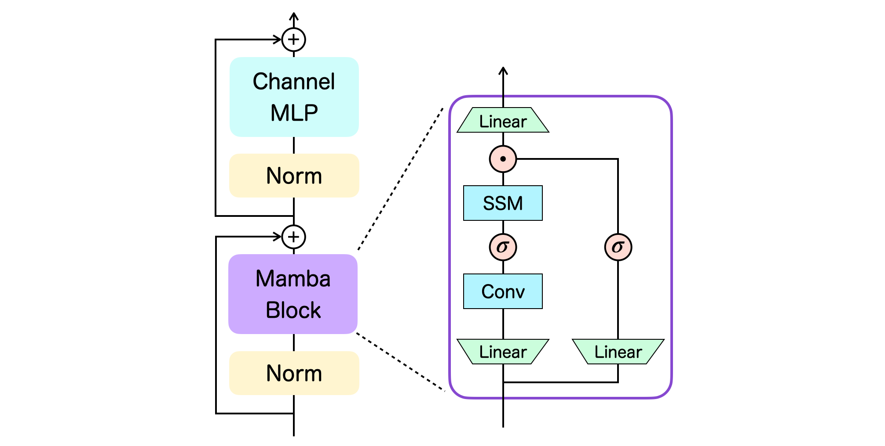
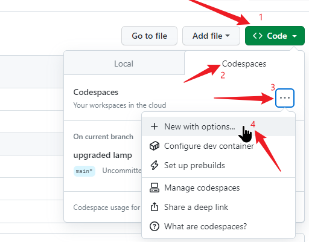
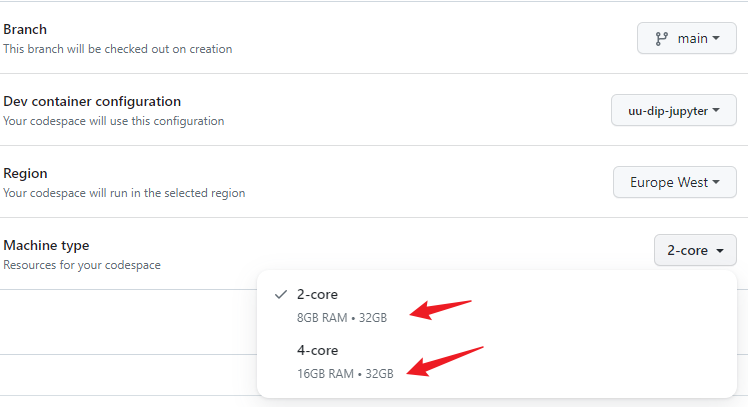
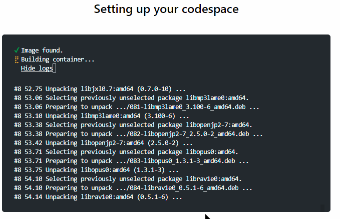
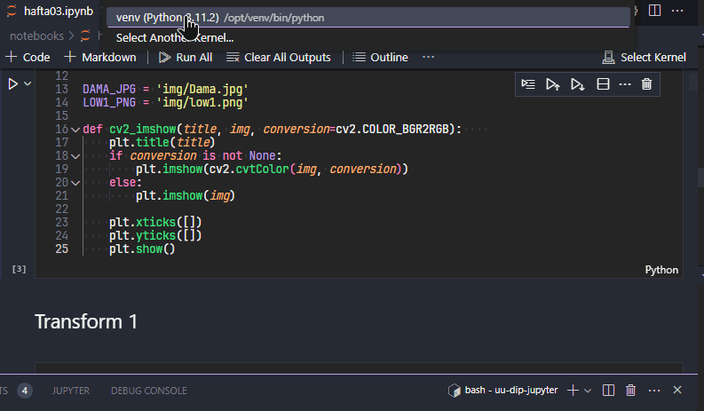
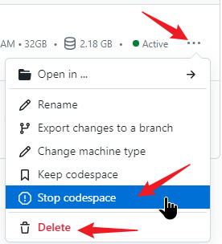
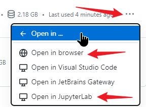

# DT vs DM

Bu çalışma [Transformer](https://arxiv.org/abs/1706.03762) ve [Mamba](https://arxiv.org/abs/2312.00752) mimarilerini popüler bir ML antremanı olan [Connect 4](https://www.kaggle.com/c/connectx/) üzerinden karşılaştırmayı amaçlamaktadır.

## Yöntem

[Decision Transformer](https://github.com/kzl/decision-transformer) kullanılarak yapılmış [bu çalışma](https://github.com/odudler/dl2023) temel alınarak üzerine [bu çalışmadaki](https://github.com/Toshihiro-Ota/decision-mamba)

`Mamba Block` yapısı eklenmiştir. Temel çalışmada eğitilmiş olan DT modeline benzer şekilde bir DM modeli eğitilerek bu iki modelin karşılıklı oynadığı oyunların sonucu incelenecektir.

## Dosyalar

[/src](/src/) klasöründeki `decision_mamba_layers.py` ve `decision_mamba.py` dosyaları [bu çalışmadan](https://github.com/Toshihiro-Ota/decision-mamba), diğerleri ise [bu çalışmadan](https://github.com/odudler/dl2023) alınarak ihtiyaca göre değiştirilmiştir.

[/serializedObjs](/serializedObjs/) klasöründe eğitilmiş modellerin parametreleri bulunmakta; [dt](/serializedObjs/dt/) klasöründeki içerik olduğu gibi temel çalışmadan alınmıştır. [dm](/serializedObjs/dm/) klasöründeki içerik ise bu çalışma ile üretilmektedir. Bu parametrelerin oluşması için [>= 50 MiB](https://docs.github.com/en/repositories/working-with-files/managing-large-files/about-large-files-on-github#:~:text=is%20larger%20than-,50%20MiB,-%2C%20you%20will%20receive) ve/veya geçici olarak kullanılan dosyalar [/tmp](/tmp/) klasörüne atılmakta ve bu klasördeki dosyalar [takip edilmeMEktedir](./.gitignore).

## Akış

[notebooks](/notebooks/) klasöründeki;

1. [offline_data.ipynb](/notebooks/offline_data.ipynb) dosyasında [farklı bir çalışmada](https://github.com/AbdallahReda/Connect4) mevcut olan (C4 oynama konusunda) "uzman sistem" olan 2 ajanın (`MinimaxAgent`) karşılıklı oyunları kaydedilmektedir.

1. [offline_train.ipynb](/notebooks/offline_train.ipynb) dosyasında bir önceki adımda elde edilen oyun verisi üzerinden `DecisionMamba` modeli eğitilmektedir.

1. [online_train.ipynb](/notebooks/online_train.ipynb) dosyasında önceki çıktılar ve `MinimaxAgent` kullanılarak `DecisionMamba` modeli oyun içinde eğitilmektedir.

1. [side_by_side.ipynb](/notebooks/side_by_side.ipynb) dosyasında ise bu eğitim sonucu elde edilen `DecisionMamba` ve temel çalışmada bu konuda eğitilmiş olan `DecisionTransformer` karşılıklı oyun oynamaktadır.

## Önemli Hususlar

- Eğitim dosyalarındaki parametreler modelin boyutunu, yeteneğini ve eğitim süresini doğrudan etkilemektedir; dolayısıyla burada olabilecek en düşük değerler kullanılmıştır. Kullanmadan önce gözden geçirilmesi faydalı olacaktır.

- Benzer şekilde eğitim çıktılarına "test" ön eki ile isim verilmiştir. Çıktıları saklamak için daha anlamlı isimler tercih edilebilir. Bu isimler dosyalar arasında eşitlenmediğinde (bir dosyadaki çıktı diğer dosyada girdi olarak kullanılıyor) sonuçlar eksik/hatalı oluşabilir.

## Çalıştırma Seçenekleri

### [Codespaces](https://docs.github.com/en/codespaces) Üzerinde

Herhangi bir bilgisayarda (yüksek donanıma gerek yok, modern bir tarayıcı çalıştırabilmesi yeterli) tarayıcı üzerinde çalışmak için ideal.

- Github hesabınızla oturum açın (an itibariyle ücretsiz hesap için aylık 120 saat/core veriyor: 2 core 60 saat, 4 core 30 saat boyunca kullanılabilir; eğitim hesabı için daha iyi koşullar [mevcut](https://github.com/features/codespaces#pricing)).
- Aşağıdaki gibi `Code>Codespaces` seçeneklerinden `New with options...` komutu ile devam edip\
\
uygun yapılandırmayı (en önemlisi makine tipi) seçip\
\
yeni bir ortam oluşturun:\

- Bekleyin! İlk seferi _biraz_ uzun sürecek.\

- Bir `notebook` açtıktan sonra eğer seçili değilse `venv` isimli `kernel`'i seçin.\

- VS Code sadece bir editör, `Jupyter Notebook` özelliklerini kendi içinde sunuyor dolayısıyla aynı mantık geçerli.
- İşi bittiğinde [Codespaces](https://github.com/codespaces) adresinden (hakkın boşa gitmemesi için) ilgili makineyi kapatın (ya da tekrar kullanılmayacaksa silin).\

- Tekrar kullanmak gerektiğinde [aynı adresten](https://github.com/codespaces) VS Code ya da Jupyter (ile tarayıcıdan ya da diğer seçeneklerle UZAKTAKİ ortama yerel bilgisayardan) bağlanabilirsin:\

### Bilgisayardan

[Docker Desktop](https://docs.docker.com/get-docker/), [VS Code](https://code.visualstudio.com/) ve [Remote Extension](https://marketplace.visualstudio.com/items?itemName=ms-vscode-remote.vscode-remote-extensionpack) kurulu bir bilgisayarda bu repo'yu `clone`'layıp ilgili klasör için `Open Folder In Container...` komutunu çalıştırın.

Bu seçenek yerel kaynakları kullanabiliyor olması nedeniyle cihazın durumuna göre daha performanslı olabilir fakat bahsi geçen araçları kullanmayı gerektirdiği için tecrübe (sahibi olmayı ya da edinmek üzere zaman harcamayı) gerektiriyor.